EPITA Paris — B.Sc. Computer Science &nbsp;·&nbsp; Full-Stack Developer Intern @ Askeal &nbsp;·&nbsp; Paris, France

  

 

### 01 — Focus

  

### 02 — Stack

### 03 — Workflow · life @ Askeal

Shipping full-stack, security-adjacent product features: React front ends, Node.js/TypeScript services, auth flows &amp; DB-driven features — through Git branching, GitLab MRs and integration validation before production.

### 04 — Projects

<table>
<tr>
<td width="33%" valign="top">

**GDPR Copilot**
 AI compliance assistant — scans policies &amp; source code for GDPR risk using RAG.
  `Python` `OpenAI API` `RAG` `SQLite`

</td>
<td width="33%" valign="top">

**Itinera**
 Preference-based recommendation engine built on user signals &amp; personalization.
  `React` `FastAPI` `Node.js` `PostgreSQL` `MongoDB` `Neo4j`

</td>
<td width="33%" valign="top">

**CineVault**
 Full-stack movie discovery platform — search, advanced filters, TMDB API.
  `Python` `Flask` `PostgreSQL` `JavaScript`

</td>
</tr>
</table>

more projects — WorkSpeak AI · RedAlert · Cybersecurity Labs

 

| Project | Description | Stack |
|---|---|---|
| **WorkSpeak AI** | Backend-focused data processing & integration service | `Python` `FastAPI` `PostgreSQL` |
| **RedAlert** | Android wellness app — cycle tracking, mood logging, personalized insights | `Java` `Android Studio` `Firebase` |
| **Cybersecurity Labs** | Hands-on offensive security — Root-Me, Burp Suite, HTTP & auth exploitation | `Web Security` `Burp Suite` `Root-Me` |

### 05 — Live Stats

Rendered daily by a script I wrote — not a shared badge service. Pulls real numbers straight from the GitHub API.

### 06 — Connect

