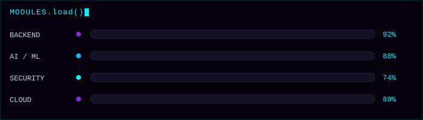
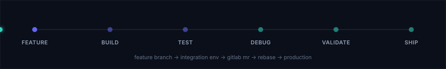

 

### `[ 01 ]` IDENTITY.sys

<pre align="center">
NAME        Yashvi Tank
ROLE        Full-Stack Developer Intern @ Askeal (cybersecurity × AI)
EDUCATION   EPITA Paris — B.Sc. Computer Science, final year
LOCATION    Paris, France  [UTC+2]
FOCUS       Backend Engineering · AI Systems · Web Security
</pre>

### `[ 02 ]` STATUS.live

  

### `[ 03 ]` TECH.DNA

<table>
<tr><td><b>LANG</b></td><td></td></tr>
<tr><td><b>WEB</b></td><td></td></tr>
<tr><td><b>SERVER</b></td><td></td></tr>
<tr><td><b>DATA</b></td><td>&nbsp;</td></tr>
<tr><td><b>CLOUD</b></td><td></td></tr>
<tr><td><b>AI/LLM</b></td><td>

</td></tr>
<tr><td><b>TOOLS</b></td><td>&nbsp;</td></tr>
</table>

### `[ 04 ]` PRODUCTION_MODE — life @ Askeal

Shipping full-stack, security-adjacent product features: React front ends, Node.js/TypeScript services, auth flows &amp; DB-driven features — through Git branching, GitLab MRs and integration validation before production.

### `[ 05 ]` PROJECT_SELECT

<table>
<tr>
<td width="33%" valign="top">

**⟩ GDPR_COPILOT.ai**
 AI compliance assistant — scans policies & source code for GDPR risk using RAG.
 `Python` `OpenAI API` `RAG` `SQLite`

</td>
<td width="33%" valign="top">

**⟩ ITINERA.rec**
 Preference-based recommendation engine built on user signals & personalization.
 `React` `FastAPI` `Node.js` `PostgreSQL` `MongoDB` `Neo4j`

</td>
<td width="33%" valign="top">

**⟩ CINEVAULT.db**
 Full-stack movie discovery platform — search, advanced filters, TMDB API.
 `Python` `Flask` `PostgreSQL` `JavaScript`

</td>
</tr>
</table>

<b>▸ load 3 more modules</b> — WorkSpeak AI · RedAlert · Cybersecurity Labs

 

| Module | Description | Stack |
|---|---|---|
| **WORKSPEAK_AI.sys** | Backend-focused data processing & integration service | `Python` `FastAPI` `PostgreSQL` |
| **REDALERT.apk** | Android wellness app — cycle tracking, mood logging, personalized insights | `Java` `Android Studio` `Firebase` |
| **CYBERLABS.sh** | Hands-on offensive security — Root-Me, Burp Suite, HTTP & auth exploitation | `Web Security` `Burp Suite` `Root-Me` |

### `[ 06 ]` TELEMETRY

 

### `[ 07 ]` CONTRIBUTIONS.exe

<code>// snake.exe is consuming contribution_grid...</code>
 
<picture>
  <source media="(prefers-color-scheme: dark)" srcset="https://raw.githubusercontent.com/Yashvi-tank/Yashvi-tank/output/github-contribution-grid-snake-dark.svg" />
  <source media="(prefers-color-scheme: light)" srcset="https://raw.githubusercontent.com/Yashvi-tank/Yashvi-tank/output/github-contribution-grid-snake.svg" />
  
</picture>

### `[ 08 ]` CONNECT()

